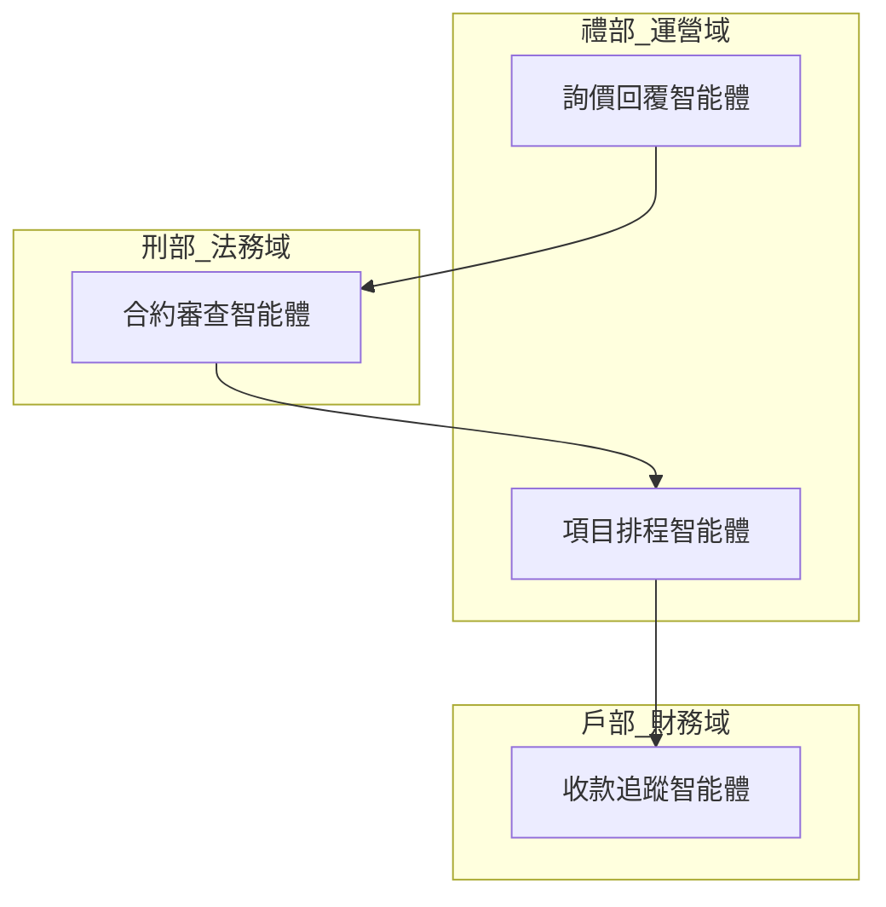

# 🏛️ Agent Builder — 三省六部智能體設計工坊

## 概念

> **把業務流程轉化為智能體集群。三省決策、六部執行、門禁把關。**

企業管理者描述業務 → Agent Builder 結構化採集需求 → 分析流程節點 → 映射到六域 → 設計專屬智能體 → 生成可部署的技能包和儀表板。

每個 Phase 之間內嵌門禁對（skill-router + skill-compliance），確保流程不被跳過。

## 📥 一行安裝

```bash
mkdir -p skills/agent-builder && curl -sSL https://raw.githubusercontent.com/Bryan-cmf/agentic-infrastructure/main/agent-builder/SKILL.md -o skills/agent-builder/SKILL.md
```

## 🏛️ 三省六部架構

```
                    ┌─────────────┐
                    │   👤 用戶    │
                    │  業務描述    │
                    └──────┬──────┘
           ┌───────────────┼───────────────┐
           ▼               ▼               ▼
    ┌──────────┐    ┌──────────┐    ┌──────────┐
    │ 📋 中書省 │    │ 🔍 門下省 │    │ 🚀 尚書省 │
    │ 需求→設計 │───▶│ 審計→駁回 │───▶│ 生成→部署 │
    │ Phase 1-2│    │ Phase 3  │    │ Phase 4  │
    └──────────┘    └──────────┘    └──────────┘
         │               │               │
    ┌────┴────┐    ┌────┴────┐    ┌────┴────┐
    │router   │    │compliance│   │compliance│
    │(Pre-Gate)│   │(Post-Gate)│  │(Post-Gate)│
    └─────────┘    └─────────┘    └─────────┘

六部（6-Domain Agent Clusters）：
┌──────────┬──────────┬──────────┬──────────┬──────────┬──────────┐
│  👤 吏部  │  💰 戶部  │  📋 禮部  │  🛡️ 兵部  │  ⚖️ 刑部  │  🏗️ 工部  │
│  人事域   │  財務域   │  運營域   │  風控域   │  法務域   │  工程域   │
└──────────┴──────────┴──────────┴──────────┴──────────┴──────────┘
```

---

## 🚀 執行流程（4 Phase × 門禁對）

### Phase 1：📋 中書省 — 需求採集

```
🛡️ Pre-Gate: skill-router → required_skills: [agent-builder]
```

#### Step 1.1：結構化訪談

向用戶提出 12 題，採集業務全貌：

| # | 問題 | 目的 |
|---|------|------|
| 1 | 您的企業/團隊主要做什麼？一句話描述核心業務 | 建立業務基線 |
| 2 | 目前有多少員工？部門結構是怎樣的？ | 了解組織規模 |
| 3 | 您最花時間的三件事是什麼？（痛點排序） | 識別核心痛點 |
| 4 | 這些事目前怎麼做的？用了哪些工具？ | 現有流程映射 |
| 5 | 哪些步驟是重複性、可自動化的？ | 自動化機會點 |
| 6 | 數據存在哪裡？（郵件/Excel/ERP/CRM...） | 數據源識別 |
| 7 | 哪些決策需要人來做？哪些可以交給系統？ | 決策邊界 |
| 8 | 團隊最常溝通什麼？用什麼工具？ | 協作模式 |
| 9 | 有沒有合規/法規要求？（行業特定） | 風險約束 |
| 10 | 您理想的「自動化後」是什麼畫面？ | 成功願景 |
| 11 | 預算和時間限制？ | 資源約束 |
| 12 | 有沒有已經在用的 AI 工具？效果如何？ | 現有 AI 成熟度 |

#### Step 1.2：繪製業務流程圖

從訪談結果提取業務節點 → 繪製流程圖：

```markdown
## 業務流程圖：[流程名稱]


#### Step 1.3：痛點矩陣

| 流程節點 | 痛點 | 頻率 | 當前耗時 | 自動化潛力 |
|----------|------|------|---------|-----------|
| 合約審查 | 每次都要人工逐條看 | 5次/週 | 2h/次 | 🔴 高 |
| 發票收款 | 忘記追蹤逾期 | 20次/月 | 0.5h/次 | 🟡 中 |

輸出：《業務需求地圖》

---

### Phase 2：📋 中書省 — 智能體設計

```
🛡️ Pre-Gate: skill-compliance → 檢查 Phase 1 訪談和流程圖是否完成
```

#### Step 2.1：流程節點 → 六域映射

將每個業務流程節點分配到六域：

| 業務節點 | 所屬域 | 智能體角色 | 觸發條件 |
|----------|--------|-----------|---------|
| 合約審查 | ⚖️ 刑部（法務域） | 合約審查智能體 | 收到新合約時 |
| 發票收款 | 💰 戶部（財務域） | 收款追蹤智能體 | 發票到期前3天 |
| 客戶詢價 | 📋 禮部（運營域） | 詢價回覆智能體 | 收到詢價郵件時 |

#### Step 2.2：每域展開智能體集群

對每個域，生成 2-5 個專屬智能體：

```yaml
# 示例：⚖️ 刑部（法務域）
domain: 法務
agents:
  - name: 合約審查智能體
    role: 自動審查標準合約，標記異常條款
    trigger: 收到新合約 PDF
    tools: [pdf-read, text-compare, clause-database]
    collaborators: [項目智能體, 風控智能體]
    
  - name: 合規檢查智能體
    role: 定期檢查業務流程是否符合行業法規
    trigger: 每月1號 + 法規更新時
    tools: [web-search, document-scan, report-generate]
    collaborators: [審計智能體]
    
  - name: 知識產權智能體
    role: 監控品牌侵權、專利到期
    trigger: 每週掃描
    tools: [web-search, trademark-api, alert]
    collaborators: [法務主管]
```

#### Step 2.3：智能體協作關係圖



輸出：《智能體配置矩陣》

---

### Phase 3：🔍 門下省 — 設計審計

```
🛡️ Pre-Gate: skill-compliance → 檢查 Phase 2 配置矩陣是否包含六域
```

#### Step 3.1：斷點檢查

逐個檢查業務流程是否有智能體覆蓋：

| 流程節點 | 智能體 | 狀態 |
|----------|--------|------|
| 客戶詢價 | 詢價回覆智能體 | ✅ 已覆蓋 |
| 銷售報價 | — | 🔴 斷點！無智能體 |

#### Step 3.2：權限審查

| 智能體 | 工具權限 | 風險 | 建議 |
|--------|---------|------|------|
| 合約審查 | pdf-read | 🟢 安全 | — |
| 收款追蹤 | 接入銀行API | 🔴 高 | 限只讀，加確認 |

#### Step 3.3：重複檢測

| 智能體 A | 智能體 B | 重疊度 | 建議 |
|----------|---------|--------|------|
| 合約審查 | 合規檢查 | 30% | 🟡 可合併或明確分工 |

#### Step 3.4：Pre-mortem 預判

使用 agent-previsor 展開 3 條失敗路徑：

```
路徑 A：智能體之間信息孤島 → 緩解：統一記憶層
路徑 B：權限過大導致誤操作 → 緩解：只讀優先 + 確認機制
路徑 C：用戶不信任輸出 → 緩解：第一期只做輔助建議，不做自動決策
```

輸出：《審計報告 + 修正建議》

---

### Phase 4：🚀 尚書省 — 部署生成

```
🛡️ Pre-Gate: skill-compliance → 檢查 Phase 3 審計報告是否全部通過
```

#### Step 4.1：生成智能體 SKILL.md

每個智能體生成標準 skill 文件：

```markdown
---
name: [智能體名稱]
description: [中文關鍵詞] [英文關鍵詞]
---

# [智能體名稱]

## 角色
[一句話定義]

## 觸發條件
[何時被調用]

## 工具權限
- [tool-1]: [用途] [權限級別]

## 協作關係
- 上游：[接收誰的輸入]
- 下游：[輸出給誰]

## 執行流程
1. [Step 1]
2. [Step 2]
3. [Step 3]

## 門禁要求
- 任務前：skill-router 路由檢查
- 任務後：skill-compliance 合規檢查
```

#### Step 4.2：生成 HTML 儀表板

輸出一個三省六部可視化看板，包含：
- 三省流程狀態圖
- 六域智能體總覽
- 協作關係拓撲圖
- 每個智能體的運行狀態指示燈

#### Step 4.3：生成部署包

```
agent-cluster/
├── README.md              # 集群說明
├── dashboard.html         # 三省六部看板
├── skills/
│   ├── agent-1/SKILL.md
│   ├── agent-2/SKILL.md
│   └── ...
├── BOOTSTRAP.md           # 一鍵啟動提示詞
└── SELF-CHECK.md          # 自查指南
```

輸出：《智能體集群部署包》

---

## 🔴 門禁對（嵌入每個 Phase）

每個 Phase 之間都有強制門禁：

```
Phase N 開始
    │
    ▼
skill-router → required_skills: [phase-N-skills]
    │
    ▼
執行 Phase N
    │
    ▼
skill-compliance（子代理）→ 字串比對 → PASS/REJECT
    │
    ├── PASS → Phase N+1
    └── REJECT → 駁回 + 附缺失清單 + 重做 Phase N
```

全部強制，全部檢查。門禁對來自 Agentic Infrastructure 的 skill-router 和 skill-compliance 技能。

---

## 🎯 MVP 範圍

| 產出 | 格式 | 優先級 |
|------|------|--------|
| 業務需求地圖 | Markdown | 🔴 P0 |
| 智能體配置矩陣 | YAML + Markdown | 🔴 P0 |
| 設計審計報告 | Markdown | 🔴 P0 |
| 智能體 SKILL.md 包 | 多個 .md 文件 | 🔴 P0 |
| HTML 三省六部儀表板 | HTML | 🟡 P1 |
| SELF-CHECK 自查指南 | Markdown | 🟡 P1 |
| BOOTSTRAP 啟動提示詞 | Markdown | 🟡 P1 |

---

## 🔗 依賴技能

- **skill-router** — Pre-Gate（每個 Phase 前路由）
- **skill-compliance** — Post-Gate（每個 Phase 後合規檢查）
- **agent-previsor** — Phase 3 Pre-mortem 預判
- **agentic-infra** — 可選，用於一鍵 Bootstrap 部署

---

## 授權

MIT
